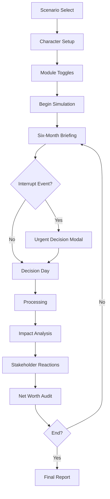

# Consequence Pipeline - UI Design

Borrowed interaction **grammar** from Fantasy President Career; original Life Ledger branding and components.

## Screen Flow

## Component Map (V1)

| Stage | Route | Key components |
|-------|-------|----------------|
| Scenario select | `/scenarios` | `ScenarioCardList` |
| Character setup | `/create` | `TraitGrid`, `BalanceSheetForm` |
| Settings | `/create/modules` | `ModuleTogglePanel` |
| Briefing | `/play/briefing` | `MetricsRibbon`, `BriefingNarrative` |
| Decision | `/play/decide` | `DecisionPrompt`, `OpenActionInput`, `ModifierChips` |
| Processing | `/play/processing` | `ProcessingSpinner` |
| Analysis | `/play/analysis` | `ImpactCards`, `ShowTheMath` |
| Reactions | `/play/reactions` | `StakeholderCard`, `SentimentScore` |
| Audit | `/play/audit` | `BalanceSheetGrid`, `WaterfallChart`, `ProgressRings` |
| Dashboard | `/play/dashboard` | `TimelineHistory`, `SkillTree`, `RiskRadar` |
| DreamHome | `/play/dream-home` | `ListingCard`, `AffordabilityGates` |

## Metrics Ribbon (briefing header)

- Net worth · Δ this period
- Take-home pay
- Savings rate
- Emergency runway (months)
- Housing burden %
- DTI

## Affordability Gates (DreamHome)

Five gates per listing:

1. **Cash to close** - down + closing + move + furnish
2. **Liquidity remaining** - post-close emergency fund
3. **Monthly affordability** - 28/36, housing/income
4. **Stress test** - +15% insurance, $7.5k repair, 3-mo income loss
5. **Life fit** - commute, schools, duration

Knowledge modes: `guardrails` | `acknowledge` | `sandbox`

## Stakeholder Personas (reactions)

- Partner / spouse
- Future You (35)
- Future You (65)
- Recruiter
- Mortgage underwriter
- Fee-only financial planner
- Skeptical parent
- Manager

Each exposes competing objectives - not omniscient advice.

## Related

- [ADR 007](../adr/007-ui-consequence-pipeline.md)
- [User journey](../vision/user-journey.md)
